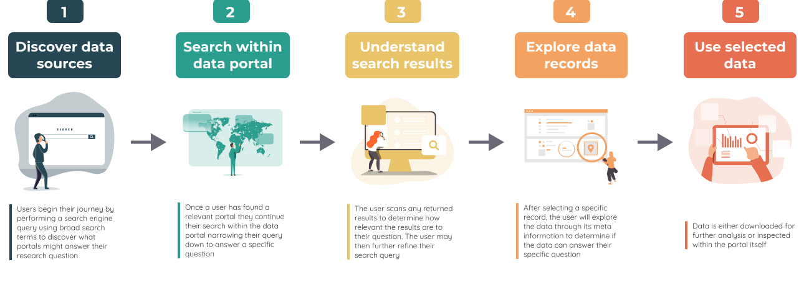
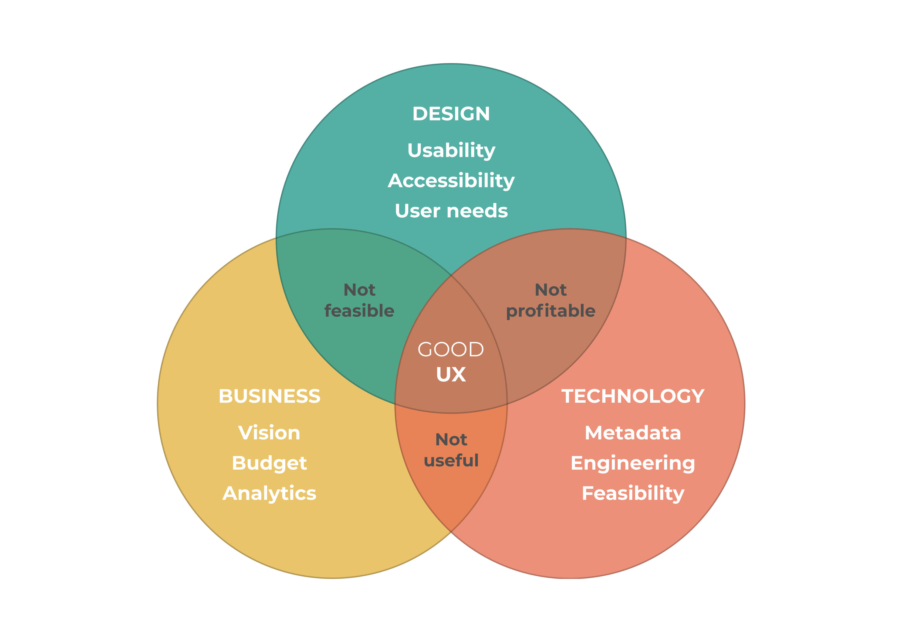

# User Research Outputs

> Lorem ipsum dolor sit amet, consectetur adipiscing elit, sed do eiusmod tempor incididunt ut labore et dolore magna aliqua. Ut enim ad minim veniam, quis nostrud exercitation ullamco laboris nisi ut aliquip ex ea commodo consequat. Duis aute irure dolor in reprehenderit in voluptate velit esse cillum dolore eu fugiat nulla pariatur. Excepteur sint occaecat cupidatat non proident, sunt in culpa qui officia deserunt mollit anim id est laborum.

## Why did we create this?

Lorem ipsum dolor sit amet, consectetur adipiscing elit, sed do eiusmod tempor incididunt ut labore et dolore magna aliqua. Ut enim ad minim veniam, quis nostrud exercitation ullamco laboris nisi ut aliquip ex ea commodo consequat. Duis aute irure dolor in reprehenderit in voluptate velit esse cillum dolore eu fugiat nulla pariatur. Excepteur sint occaecat cupidatat non proident, sunt in culpa qui officia deserunt mollit anim id est laborum.

*User journey for discovering and accessing geospatial data. Illustrations by [undraw.co](https://undraw.co/license)*

## Outputs
*	Pilot Area Overviews
*	Polot Area Use Cases
*	Pilot Area Stakeholder Personas
*   Pilot Area Stakeholder User Stories

### Overviews

>The pilot overviews are designed to give an insight into the individual pilot areas. They describe who the pilot areas main points of contact are, what they are currently working on and what success looks like to them. The overviews are a first look into the minds of the organisations that are the point of contact for each pilot area and also should share who their key stakeholders are.

### Use Cases

>The use cases for each pilot area point of contact will describe where the national land data platform fits in with their particular ambitions and those of their stakeholders. They will be presented as a statement of how the NLDP will help them succeed

### Personas

>There will be a persona for each stakeholder of the pilot areas that would have a reason to interact directly with the NLDP. The personas will consist of:
    1. Who the stakeholder is - what is their job role and who do they work for
    2. How they spend their time currently - what do they spend most of their time doing with relation to lad planning
    3. Their problem statement - A disemmination of the information above into a statement of a problem the NLDP could solve
    4. Opportunities - a list of possible solutions to the problem statement

### User Stories

>The user stories will describe processes that the personas above follow in relation to land planning i.e. identifying sites. The user stories will follow:
    1. What is the current process - what do they currently do when identifying a site
    2. Where is the greatest effort required - where do they currently spend the most time or what is the hardest part when identifying a site e.g. historic land use data not accessible
    3. What could the process look like with the creation of the NLDP - with the creation of the NLDP what could change i.e. perhaps the time to find the historic land use data would be greatly reduced as it was in one central accessible location.

## Other resources

Lorem ipsum dolor sit amet, consectetur adipiscing elit, sed do eiusmod tempor incididunt ut labore et dolore magna aliqua. Ut enim ad minim veniam, quis nostrud exercitation ullamco laboris nisi ut aliquip ex ea commodo consequat. Duis aute irure dolor in reprehenderit in voluptate velit esse cillum dolore eu fugiat nulla pariatur. Excepteur sint occaecat cupidatat non proident, sunt in culpa qui officia deserunt mollit anim id est laborum. 

*Formula for good user experience*

